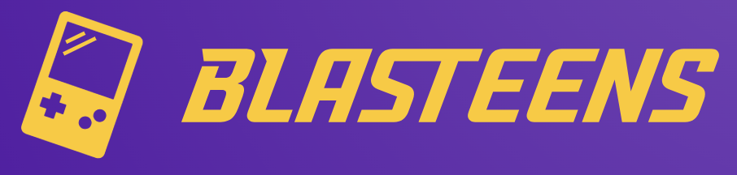
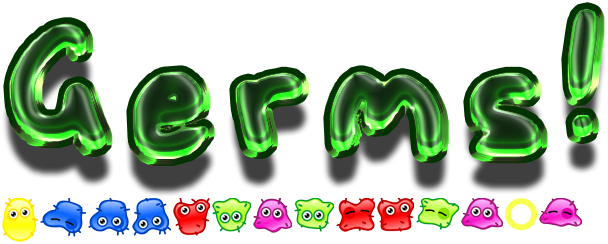
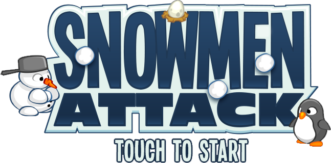
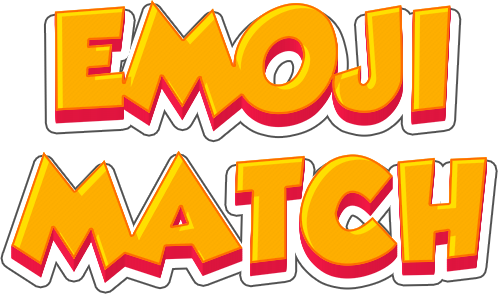
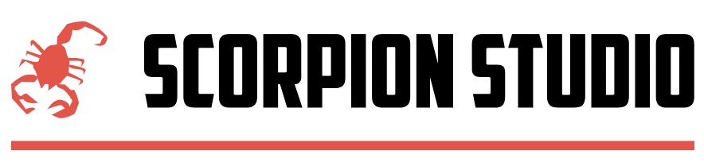

# Blasteens

  

Blasteens, is an advanced gaming platform featuring three captivating games with built-in rewards showcased on leaderboards to attract competitive players. This aligns seamlessly with Blast's initiative to diversify its ecosystem and enhance user engagement. Blasteens provides a developer-friendly environment for creators to showcase their work. Notably, it stands out with a user-friendly game developer SDK and a dedicated marketplace for character trading, enriching the overall gaming experience.
 
> Let's ***blast*** some games! Visit [Blasteens](https://blasteens-ui.vercel.app/) !

## Table of Contents
* [🔥 Point of Attraction](#-point-of-attraction)
  * [👾 Gamer-orientation](#-gamer-orientation)
  * [👨‍💻 Developer-orientation](#-developer-orientation)
* [🌟 Features](#-features)
  * [🎮 Game](#-game)
    * [Arcade](#arcade)
    * [Independent Games](#independent-games) 
    * [AAA Games](#aaa-games)
    * [How to Play Arcade?](#how-to-play-arcade)
  * [Market](#market)
  * [🥇 Prize](#-prize)
  * [💰 Developer Bonus Reward](#-developer-bonus-reward)
  * [🍀 Lotto](#-lotto)
  * [🔨 SDK](#-sdk)
* [💻 Tech Stack](#-tech-stack)
* [👀 Preview](#-preview)
* [🤝 How to contribute?](#-how-to-contribute)
* [📜 Available Scripts](#-available-scripts)
* [🧱 Developed By](#-developed-by)

## 🔥 Point of Attraction
  ### 👾 Gamer-orientation
  Attractions for gamers on Blasteens include the opportunity to ascend the leaderboard and vie for prizes from the pool. Additionally, players can engage in farming activities, selling items in the marketplace for profit, or investing in rare items for financial gains. Beyond financial incentives, users can relish the entertaining games crafted by developers. Blasteens distinguishes itself from traditional gaming platforms by detailing prize distribution in a smart contract, ensuring transparency and fairness for all participants.
  ### 👨‍💻 Developer-orientation
  Blasteens stands as a haven for developers, offering a platform to unleash creativity and earn through in-game item sales. With a built-in reward system and the potential for user investments in rare items, developers have the tools to craft captivating experiences. Transparent smart contracts ensure fair prize distribution, building a foundation of trust. Blasteens actively encourages community collaboration, providing developers with networking opportunities and exciting project prospects. Joining the web3 ecosystem becomes more accessible for skilled game developers through Blasteens, fostering a supportive environment. The renowned Blast and Blasteens brand is set to allure gamers, establishing a mutually beneficial relationship for both developers and players. Notably, the more players engage with your game, the greater the yield. Additionally, popular games receive extra bonus yield from Blasteens, enhancing the incentives for developers.
## 🌟 Features
  ### 🎮 Game
  #### Arcade
  Step into the Blasteens Arcade, a realm of boundless gaming excitement. Explore a variety of captivating games, each crafted to provide a unique and thrilling experience. The Arcade, the pulsating heart of Blasteens, invites players to embark on adventures, compete on leaderboards, and immerse themselves in a vibrant gaming community. With a collection of nostalgic old-style games, it operates like an online arcade where purchasing tickets allows you to climb leaderboards and reap rewards.
  - **Escape From Germs** 
      

        
      

      

        Navigate through a virtual world while avoiding and escaping from germs. Test your reflexes and strategic thinking in this exciting game.
      

  - **Snowman Defender** 
      

        
      

      

        Defend your snowman against waves of attackers. Utilize various defenses and power-ups to keep your snowman safe. A thrilling defense game set in a winter wonderland.
      

  - **Emoji Match**
    

      
    

    

      Exercise your memory and matching skills in the Emoji Match game. Flip cards to find matching emoji pairs within the given time. How quickly can you match them all?
    

  - **Tommy Jumping** 
    

      
    

    

      Join Tommy in an adventurous jumping game. Help him overcome obstacles and reach new heights. How far can you guide Tommy in this endless jumping journey?
    

  #### Independent Games
  Explore the creativity of independent game developers within the Blasteens ecosystem. Our platform provides a stage for these innovative minds to showcase their talents, bringing you a diverse array of games. From unique narratives to groundbreaking mechanics, independent games on Blasteens promise an unparalleled gaming journey.
  #### AAA Games
  #### How to play Arcade?
  - Purchase your NFT ticket. Choose from 3 different types: Gold, Silver, Bronze.
  - Redeem your NFT ticket to start the game.
  - Aim for the top of the leaderboard to win the prize.
  ### Market
  Dive into the Blasteens Market, a bustling hub where in-game items come to life. Whether you're a gamer looking to enhance your experience or a developer seeking monetization opportunities, the Market is your go-to destination. Buy, sell, and trade items, contributing to the dynamic economy within the Blasteens gaming universe.
  > Market is on the way. Stay tuned!
  ### 🥇 Prize
  Ready to elevate your gaming pursuits? The Blasteens Prize Pool awaits, offering exciting rewards for those who aim high. Compete on leaderboards, achieve in-game milestones, and take home a share of the prize pool. With transparency ensured through smart contracts, the Prize Pool adds an extra layer of thrill and fairness to your gaming endeavours.
  ### 💰 Developer Bonus Reward
  At Blasteens, we recognize and celebrate the creativity of our game developers. Introducing the Game Developer Bonus Reward, an extra incentive for those whose games capture the hearts of our gaming community. As your creation becomes a sensation, enjoy additional rewards that acknowledge your contribution to the vibrant and engaging world of Blasteens. Your success is our success!
  ### 🍀 Lotto
  ### 🔨 SDK
  Calling all game developers! With our robust Software Development Kit (SDK), creating and deploying games on Blasteens has never been smoother. Unleash your creativity, utilize powerful tools, and seamlessly integrate your games into our platform. The Blasteens SDK empowers developers to shape the future of gaming within the web3 ecosystem.
  > Read more on [Blasteens SDK](https://github.com/future-web3/blasteens-sdk)

## 💻 Tech Stack
 - ReactJS
 - EthersjJs
 - WAGMI wallet integration
 - Subgraph Query
 - PhaserJs to build out some demo games
 - Redux to manage the state of the app

## 👀 Preview

## 🤝 How to contribute?
We warmly invite developers of all skill levels to contribute to our open-source project, whether through code, documentation, or community support, to help us build something truly amazing together.
This project was bootstrapped with [Create React App](https://github.com/facebook/create-react-app).

## 📜 Available Scripts
In the project directory, you can run:

### `npm start`

Runs the app in the development mode.\
Open [http://localhost:3000](http://localhost:3000) to view it in your browser.

The page will reload when you make changes.\
You may also see any lint errors in the console.

### `npm test`

Launches the test runner in the interactive watch mode.\
See the section about [running tests](https://facebook.github.io/create-react-app/docs/running-tests) for more information.

### `npm run build`

Builds the app for production to the `build` folder.\
It correctly bundles React in production mode and optimizes the build for the best performance.

The build is minified and the filenames include the hashes.\
Your app is ready to be deployed!

## 🧱 Developed By
- Blasteens is developed by _Scorpion Studio_.
  

    
  

- Also, special thanks to _[Blast](https://blast.io/en)_ !
  

    
  

